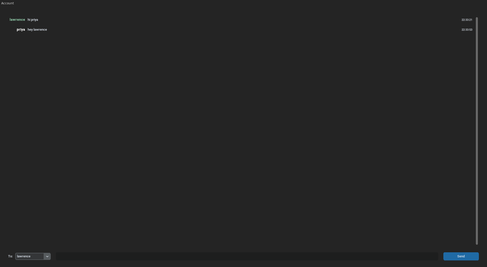

# 262chat
_by Priya Malhotra and Lavrans Bjerkestrand_



Welcome to 262chat! You can find our Part 1 custom protocol messaging documentation at [`part1/Protocol.md`](part1/Protocol.md), and our engineering design notebook for the overall project (which also contains technical details like the folder structure) at [`Notebook.md`](Notebook.md). Even more detailed technical documentation is contained inline in the Python source `*.py` files’ comments and [Python docstrings](https://peps.python.org/pep-0257/#what-is-a-docstring). The remainder of this README contains instructions on how to run and test 262chat, depending on who you are:

## Installation (for everyone)

To install the dependencies (listed in `requirements.txt`) easily, run
```shell
$ pip3 install -r requirements.txt
```
in your command terminal. Next, run one the commands below, corresponding to who you are.

## For clients

Run
```shell
$ ./gui.py
```

You should see a window like this one pop up:


Type in the server IP address and port, and turn the gRPC switch on if it is a gRPC server (i.e. if the server is running `part2/server.py`), or keep it off otherwise (i.e. if the server is running `part1/server.py`).

The rest of the UI is designed to be intuitive and easy-to-use for all people. It should be especially familiar to anyone who had used a web interface or other chat platform with a GUI. Happy chatting! :)

## For server administrators

To run the non-gRPC (Part 1) server, run
```shell
$ part1/server.py
```

To run the gRPC (Part 2) server, run
```shell
$ part2/server.py
```

## For testers

From the project root directory, run
```shell
$ python3 -m unittest -v
```
(the `-v` flag is optional, and just gives verbose logging output).

All the unit tests will run automatically. See the corresponding section in our [engineering design notebook](Notebook.md) for more on how we achieved high coverage and thorough tests for both part 1 and part 2 using a unified framework.
